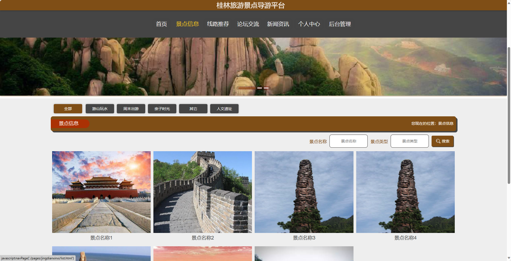
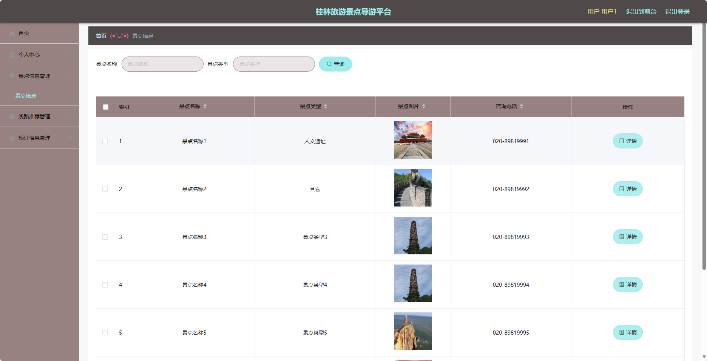

<h1 align="center">基于SpringBoot框架实现的桂林旅游景点导游平台【带文档】</h1>

<h4> 完整代码获取地址：从戎源码网（https://armycodes.com/） </h4>
<h4> 作者微信：19941326836 QQ：605739993 QQ群：655392706 </h4>
<h4> 承接计算机毕设、Java毕业设计、Python毕业设计、深度学习、机器学习 </h4>
<h4> 选题+开题报告+任务书+程序定制+安装调试+论文+答辩ppt 一条龙服务 </h4>
<h4> 毕业设计所有选题地址：(https://github.com/Descartes007/allProject) </h4>

## 项目介绍

基于SpringBoot框架实现的桂林旅游景点导游平台【带文档】：前端 vue、axios、elementui，后端 springboot、mybatis，系统角色分为：管理员和用户，管理员在管理后台景点信息、线路推荐信息等；用户可以阅读新闻资讯、查看推荐的旅游线路等。主要功能如下：

## 【前台】

- 首页：展示导游平台的基本信息和推荐景点、线路等内容。
- 景点信息：提供各个景点的详细信息，包括景点介绍、地址、交通方式等。
- 线路推荐：推荐游览桂林的线路，包括线路介绍、景点安排、费用等。
- 论坛交流：提供用户之间的交流平台，可以分享旅游经验、提问问题等。
- 新闻资讯：发布最新的旅游资讯和桂林相关新闻。
- 个人中心：用户可以查看和编辑个人信息，包括个人资料、订单记录等。

## 【后台】
### 管理员

- 个人中心：管理员可以管理自己的个人信息和权限。
- 用户管理：对用户信息进行管理，包括添加、修改和删除用户信息。
- 景点类型管理：管理景点的类型，包括添加、修改和删除景点类型。
- 景点信息管理：管理景点的详细信息，包括添加、修改和删除景点信息。
- 线路推荐管理：管理线路推荐的信息，包括添加、修改和删除线路推荐。
- 预订信息管理：管理用户的预订信息，包括查看和处理预订请求。
- 论坛交流：管理员可以管理论坛交流区，包括审核和删除帖子。
- 系统管理：管理系统的参数设置和日志记录。

### 用户

- 个人中心：用户可以查看和编辑个人信息。
- 景点信息管理：用户可以查看各个景点的详细信息。
- 线路推荐管理：用户可以查看推荐的线路信息。
- 预订信息管理：用户可以查看已预订的线路信息和处理预订请求。

## 环境

- <b>IntelliJ IDEA 2020.3</b>

- <b>Mysql 5.7.26</b>

- <b>Maven 3.6.3</b>

- <b>JDK 1.8</b>

## 运行截图

